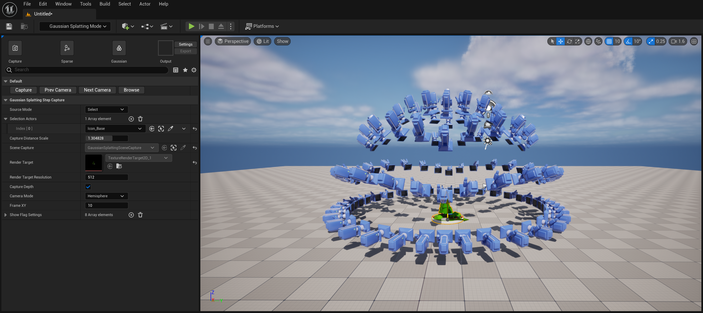
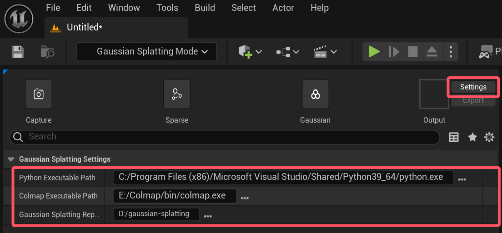

# Gaussian Splatting For Unreal Engine
**GaussianSplattingForUnrealEngine**  集成了一站式的编辑器工具用于将虚幻中的图形转换为3D高斯点云：

## 环境要求

- Unreal Engine 5.4.4 or Unreal Engine 5.5.1
- Python
- Colmap
    - https://github.com/colmap/colmap

- Gaussian Splatting
    -  https://github.com/graphdeco-inria/gaussian-splatting

按 Gaussian Splatting 仓库的README搭建训练环境，遇到问题可以在网络上搜索解决方案，搭建完成后需要在插件中指定相关目录：

## 使用文档

临时说明视频：

- https://www.bilibili.com/video/BV1GUwNeYE6c

搭建中...

